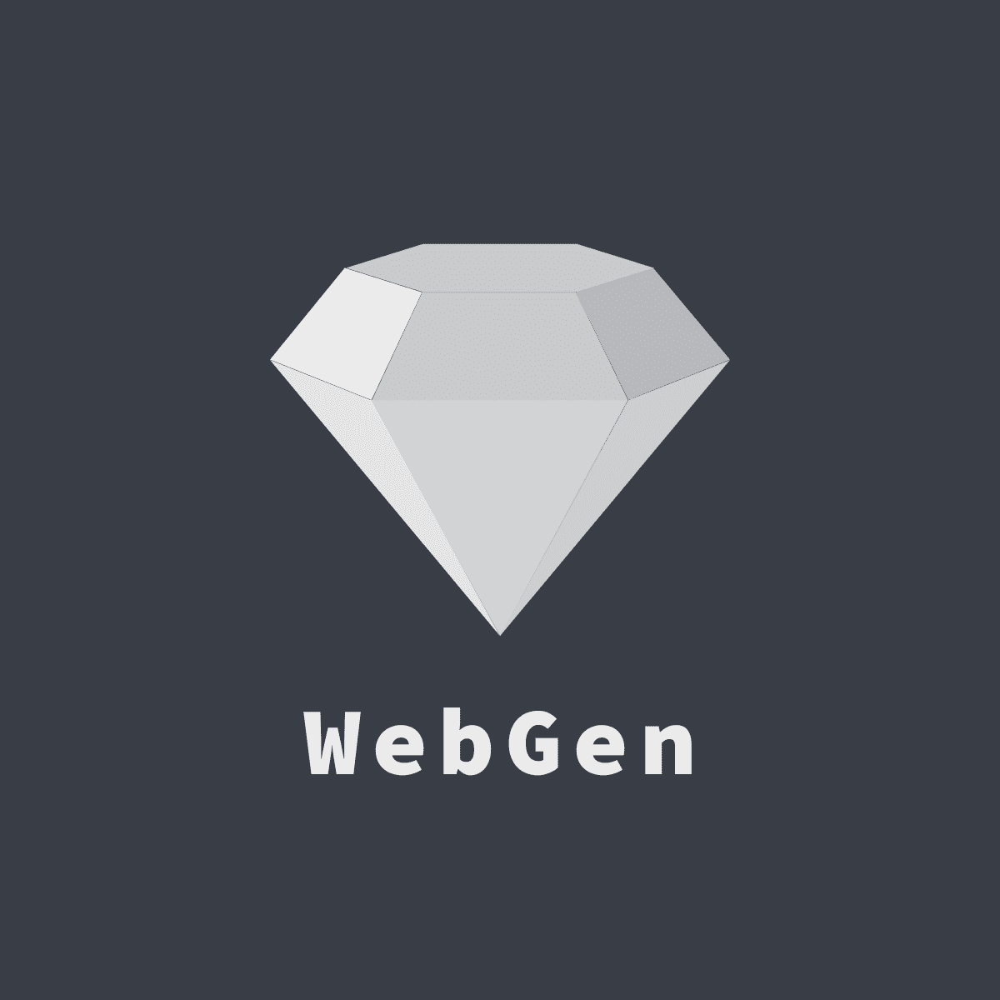

[![MIT License][license-shield]][license-url]
[![Language][language-url]][language-url]
[![Build Status][travis-badge]][travis-badge]
[![CodeQL][codeql-badge]][codeql-badge]
[![Contributors][contributors-shield]][contributors-url]
[![Issues][issues-shield]][issues-url]
[![Dependencies][dependencies-badge]][dependencies-badge]

<br />
<p align="center">
  <a href="https://github.com/Sid200026/WebGen/">
    
  </a>

  <h3 align="center">WebGen</h3>

  <p align="center">
    An open source personal website / portfolio generator
    <br />
    <a href="https://sid200026.github.io/WebGen"><strong>Explore the docs »</strong></a>
    <br />
    <br />
    <a href="http://ec2-3-15-186-149.us-east-2.compute.amazonaws.com/">View Demo</a>
    ·
    <a href="https://github.com/Sid200026/WebGen/issues/new?assignees=Sid200026&labels%5B%5D=type%3A+bug&template=bug_report.md&title=">Report Bug</a>
    ·
    <a href="https://github.com/Sid200026/WebGen/issues/new?assignees=Sid200026&labels%5B%5D=type%3A+enhancement&template=feature_request.md&title=">Request Feature</a>
  </p>
</p>

<details open="open">
  <summary>Table of Contents</summary>
  <ol>
    <li>
      <a href="#about-the-project">About The Project</a>
      <ul>
	<li><a href="#motivation">Motivation</a></li>
        <li><a href="#built-with">Built With</a></li>
      </ul>
    </li>
    <li>
      <a href="#getting-started">Getting Started</a>
      <ul>
        <li><a href="#prerequisites">Prerequisites</a></li>
        <li>
		<a href="#installation">Installation</a>
		<ul>
			<li><a href="#via-npm">Via NPM</a></li>
			<li><a href="#via-docker">Via Docker</a></li>
		</ul>
	</li>
      </ul>
    </li>
    <li><a href="#usage">Usage</a></li>
    <li><a href="#roadmap">Roadmap</a></li>
    <li><a href="#contributing">Contributing</a></li>
    <li><a href="#license">License</a></li>
    <li><a href="#contact">Contact</a></li>
    <li><a href="#acknowledgements">Acknowledgements</a></li>
  </ol>
</details>

## About The Project

[![WebGen Screen Shot][product-screenshot]][production-link]

WebGen is an open source personal website / portfolio generator developed with ❤️. Portfolios or personal websites are a great way to demonstrate the competencies you would list on a resume or talk about in an interview — they allow you to show and not just tell. It is a multi-faceted way to organize your accomplishments, goals, aspirations, and personal thought. It showcases your personality to potential employers and organizations. It provides tangible proof of your skills and abilities and demonstrates to the employer that you are qualified for that specific job.

### Motivation

This summer I finally decided to update my [website](https://sid200026.github.io/) that I developed 2 years ago. However 2 years ago, I was just starting to learn about web development and hence hardcoded everything on my website to the point where it wasn't possible for me to update it this summer. Hence I tried to find some online website generators or tools to use. Much to my surprise, the only tool I found was [this](https://github.com/github/personal-website). This would have sufficed until it struck me that the usage of this tool would require **git**, **Ruby** and **basic knowledge of web dev** and it is pretty much only for CS students or professionals. Thus I developed WebGen, which allows users of **any domain** to develop their personal websites without requiring the knowledge of programming languages, tools or technologies. You can develop your website from scratch or select some pre-made themes and receive the html,css and js file in your email. We provide you with the source code of the website you developed so that you're at liberty to decide what you want to do with it. Mostly you would want to host your website somewhere GitHub, Netlify, Render, Vercel etc. ( Video guides are present to help you host your website ).

### Built With

WebGen is built using the **PERN** ( PostgreSQL, Express, React and NodeJS ) stack.

- [React](https://reactjs.org/)
- [NodeJS](https://nodejs.org/en/)
- [AWS](https://aws.amazon.com/)
- [PostgreSQL](https://www.postgresql.org/)

## Getting Started

To get a local copy up and running follow these simple steps.

### Prerequisites

This is the list of softwares required to run WebGen and how to install them.

- **docker** ( Optional )

  - [How to Install Docker](https://docs.docker.com/engine/install/)

- **npm**
  ```sh
  npm install npm@latest -g
  ```
- **redis**

  - Linux

  ```sh
  sudo apt update
  sudo apt install redis-server
  sudo systemctl start redis-server
  ```

  - MacOS

  ```sh
  brew update
  brew install redis
  redis-server /usr/local/etc/redis.conf
  ```

  - Windows : [How to Install and Run Redis](https://riptutorial.com/redis/example/29962/installing-and-running-redis-server-on-windows)

- **postgres**

  - Linux

  ```sh
  sudo sh -c 'echo "deb http://apt.postgresql.org/pub/repos/apt $(lsb_release -cs)-pgdg main" > /etc/apt/sources.list.d/pgdg.list'
  wget --quiet -O - https://www.postgresql.org/media/keys/ACCC4CF8.asc | sudo apt-key add -
  sudo apt-get update
  sudo apt-get -y install postgresql
  sudo systemctl start postgresql
  ```

  - MacOS

  ```sh
  brew update
  brew install postgresql
  initdb /usr/local/var/postgres
  pg_ctl -D /usr/local/var/postgres start
  ```

  - Windows : [How to Install and Run PostgreSQL](https://www.postgresql.org/download/windows/)

### Installation

1. Clone the repo
   ```sh
   git clone https://github.com/Sid200026/WebGen.git
   ```
2. Change directory
   ```sh
   cd WebGen
   ```
3. Create a `.env` and `.env.production` file with the same content

   ```env
   PORT=<Port on which to run the application>
   SECRET_KEY=<Secret key used to encrypt strings>
   EMAIL_USER=<Gmail ID from which to send emails to>
   EMAIL_PASSWORD=<Password from which to send emails to>
   DATABASE_USER=<User of the database>
   DATABASE_PASSWORD=<Password of the database>
   DATABASE_NAME=<Name of database to be used>
   DATABSE_HOST=<URL on which PostgreSQL server is running Eg: 127.0.01, database ( if using docker )>
   DATABASE_PORT=<Port on which database is running Eg. 5432>
   REDIS_HOST=<URL on which Redis server is running Eg: 127.0.01, redis ( if using docker )>
   REDIS_PORT=<Port on which Redis server is running Eg: 6379>
   ```

   For example, if installing the application via npm, following is a valid env file

   ```env
   PORT=8000
   SECRET_KEY=webgen
   EMAIL_USER=************gmail.com
   EMAIL_PASSWORD=************
   DATABASE_USER=postgres
   DATABASE_PASSWORD=********
   DATABASE_NAME=postgres
   DATABSE_HOST=localhost
   DATABASE_PORT=5432
   REDIS_HOST=127.0.0.1
   REDIS_PORT=6379
   ```

   For example, if installing the application via docker, following is a valid env file

   ```env
   PORT=8000
   SECRET_KEY=webgen
   EMAIL_USER=************gmail.com
   EMAIL_PASSWORD=************
   DATABASE_USER=postgres
   DATABASE_PASSWORD=********
   DATABASE_NAME=postgres
   DATABSE_HOST=database
   DATABASE_PORT=5432
   REDIS_HOST=redis
   REDIS_PORT=6379
   ```

4. Create the user files

   ```sh
   bash scripts/user_files.sh
   ```

#### Via NPM

1. Install the dependencies

   ```sh
   npm install
   ```

2. Copy assets folder

   ```sh
   bash scripts/asset_copy.sh
   ```

3. Run the backend server

   ```sh
   npm run dev
   ```

4. Open another terminal and run the frontend server

   ```sh
   npm run bundle
   ```

5. If you want to run both of them in the same terminal, run

   ```sh
   npm run conc
   ```

#### Via Docker

1. Built the docker service

   ```sh
   docker-compose build
   ```

2. Attach container to each of the services

   ```sh
   docker-compose up -d
   ```

## Usage

For FAQs, examples, guidelines please refer to the [Documentation](https://github.com/Sid200026/WebGen/wiki)

## Roadmap

See the [open issues](https://github.com/Sid200026/WebGen/issues) and [roadmap](https://github.com/Sid200026/WebGen/projects/2) for a list of proposed features (and known issues).

## Contributing

Contributions are what make the open source community such an amazing place to be learn, inspire, and create. Any contributions you make are **greatly appreciated**.

1. Fork the Project
2. Create your Feature Branch (`git checkout -b AmazingFeature`)
3. Commit your Changes (`git commit -m 'feat(): Add some AmazingFeature'`)
4. Push to the Branch (`git push -u origin AmazingFeature`)
5. Open a Pull Request

For a more detailed walkthrough, see [CONTRIBUTING][contributing-link] for more information.

## License

Distributed under the MIT License. See [LICENSE][license-url] for more information.

## Contact

Siddharth Singha Roy - [@Sid200026][linkedin-url] - siddharthsingharoy@gmail.com

Project Link: [https://github.com/Sid200026/WebGen](https://github.com/Sid200026/WebGen)

<!-- ACKNOWLEDGEMENTS -->

## Acknowledgements

- [Prettier](https://prettier.io/)
- [ESLint](https://eslint.org/)
- [Travis CI](https://travis-ci.org/)
- [Bull](https://www.npmjs.com/package/bull)
- [Img Shields](https://shields.io)
- [AWS RDS](https://aws.amazon.com/rds/)
- [AWS EC2](https://aws.amazon.com/ec2/)
- [AWS CodeDeploy](https://aws.amazon.com/codedeploy/)
- [AWS S3](https://aws.amazon.com/s3/)
- [Hatchful](https://hatchful.shopify.com/)
- [README Template](https://github.com/othneildrew/Best-README-Template)

[contributors-shield]: https://img.shields.io/github/contributors/Sid200026/WebGen.svg?style=for-the-badge
[contributors-url]: https://github.com/Sid200026/WebGen/graphs/contributors
[issues-shield]: https://img.shields.io/github/issues/Sid200026/WebGen.svg?style=for-the-badge
[issues-url]: https://github.com/Sid200026/WebGen/issues
[license-shield]: https://img.shields.io/github/license/Sid200026/WebGen?style=for-the-badge
[license-url]: https://github.com/Sid200026/WebGen/blob/master/LICENSE
[linkedin-url]: https://www.linkedin.com/in/sid200026/
[product-screenshot]: docs/WebGen.png
[production-link]: http://ec2-3-15-186-149.us-east-2.compute.amazonaws.com
[contributing-link]: https://github.com/Sid200026/WebGen/blob/master/CONTRIBUTING.md
[travis-badge]: https://img.shields.io/travis/com/Sid200026/WebGen?style=for-the-badge
[dependencies-badge]: https://img.shields.io/david/Sid200026/WebGen?style=for-the-badge
[language-url]: https://img.shields.io/github/languages/top/Sid200026/WebGen?style=for-the-badge
[codeql-badge]: https://github.com/Sid200026/WebGen/workflows/CodeQL/badge.svg?branch=master
